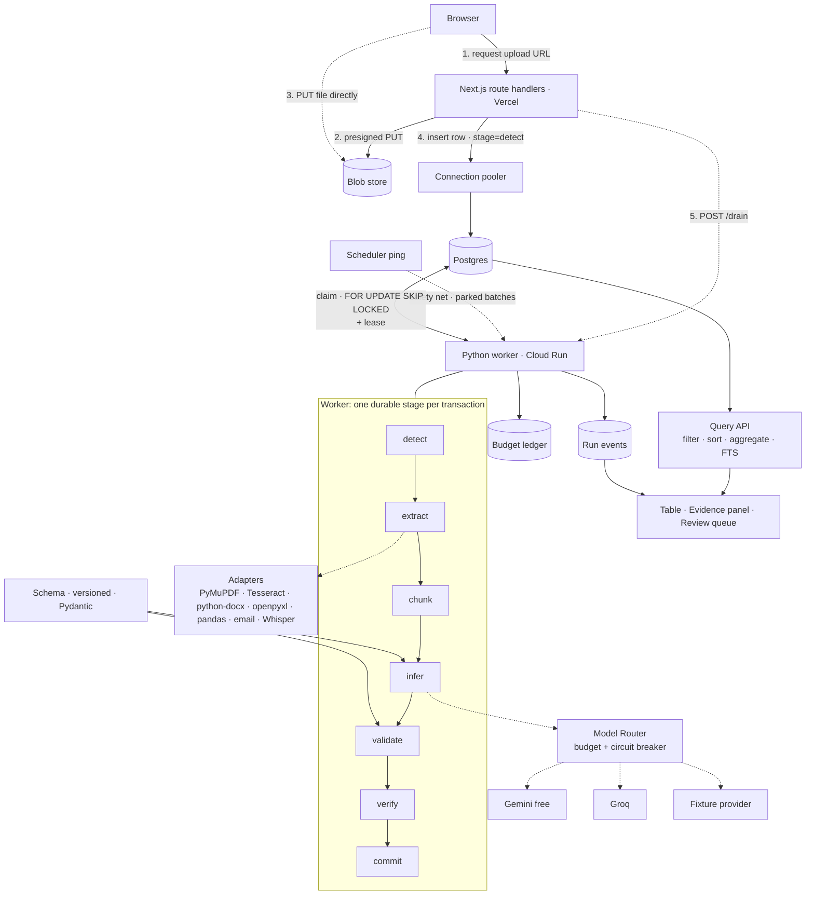

# Quarry — Design Spec

**One sentence.** You have a pile of documents that share a shape; Quarry turns them into a table you
can query, where every cell can show you the evidence it came from and flags itself when it's unsure.

This document is the design. Every choice is logged as a row in [`../decisions.md`](../decisions.md)
— chosen / alternatives / reasoning / cut — and the long-form argument behind each row, including
how the reversals happened, is in [`playbook.md`](playbook.md).

---

## 1. Who this is for

**A person holding 20–500 documents that share a shape, who needs them as rows, and who cannot write a
script.** An ops analyst with 200 invoices. A researcher with 80 papers. A support lead with 300
tickets. A CRM admin with 150 call recordings.

Below 20 documents you'd just read them. Above 500 you'd hire someone. In the middle you are stuck —
and it's the only band where the hard parts of this system (rate-limit budgeting, partial failure,
per-document status) are *felt* rather than theoretical.

**What they are trying to do**, in their words, not ours:
- "I need last quarter's invoice totals by vendor, and I have a folder of PDFs."
- "I want to know which of these 80 papers used a sample size over 500."
- "I need to know what the top five complaint themes were in these 300 emails."
- "Did the rep actually discuss pricing on these calls, and what did the customer say back?"

**What they are afraid of.** That the numbers are wrong and they won't know. This is the fear the
product is built around. Everything in §5 and §7 exists because of that sentence.

## 2. Non-goals

Stated up front so scope creep has something to bounce off. Reasons are in `decisions.md`.

| Not doing | Entry |
|---|---|
| Industry-specific extraction or ontologies | D1 |
| Multi-tenancy, SSO, RBAC, team sharing | D2 |
| Accounts, login, passwords — session only | D2 |
| Semantic / vector search, RAG, chat-with-docs | D3 |
| **Enrichment** — adding facts from outside the uploaded document | D1 |
| Video ingestion — **deferred**, not rejected | D4 |
| Web scraping | D4 |
| API/schema discovery from JSON payloads as a use case | D4 |
| Reading-order recovery, table stitching, de-skewing | D5 |
| Chunked/resumable upload | D8 |
| Calibrated numeric confidence scores | D11 |
| The rare-format long tail (`.doc`, `.odt`, `.rtf`, `.msg`, `.pptx`) — until MarkItDown is pulled in | D17 |
| Acoustic speaker diarization | D19 |
| "Insights", scheduled reports, alerting | D20 |

Charts and animations were on this list and **are not any more** — see D20. They come back as
*pipeline observability* (§3.9), not as dashboard decoration.

## 3. The journey

Seven states. Each one is a design problem, and the interesting ones are the last four.

### 3.1 First run — the empty state

The failure mode to avoid is a blank page with an upload box, because the user's first question is
"what fields should I even ask for?" So first run is **not** empty:

- Three **prepared example batches** are already there — invoices, research abstracts, a support-email
  thread — pre-extracted, browsable, with evidence intact. You can play with the product before you own
  it. This exists because the demo path and the first-run path should be the same path.
- A **starter schema library** (Invoice, Receipt, Research Paper, Support Ticket, Call Note, Resume,
  Contract) that you clone and edit rather than author from nothing. Each is only a field list, so
  the library is cheap to widen and is how the product covers a vertical's *flavour* without being
  scoped to one (D1).
- Upload accepts a folder drop, not just files. The user's data *is* a folder.

### 3.2 Defining the shape

A schema is an ordered list of fields: `key`, `label`, `type`
(`string | number | date | currency | enum | boolean | text`), `required`, `description`, and
`cardinality` (one value per document, or many rows per document for line-items).

The `description` field carries more weight than it looks like it does — it becomes part of the
extraction prompt, so "Total including tax, not the subtotal" is how a user steers the model without
knowing there is a model. The UI labels it *"How would you explain this field to a new hire?"*

It does a second job in D26: when a spreadsheet arrives with unfamiliar column headers, the
description is what lets the model decide that `Email ID` is this field and `Mobile` is not.

Schemas are **versioned**. Changing a schema does not silently invalidate rows extracted under the old
one; a row records the schema version it was produced by, and the UI shows when a row is stale.

### 3.3 Uploading

Browser → presigned `PUT` → blob store, in parallel with a concurrency cap. Per-file progress. A failed
file is retryable on its own without re-uploading the batch. Client-side pre-flight rejects the
obviously impossible (zero bytes, over the size cap) with a real reason before wasting a round trip.

**A `.zip` is accepted and expanded.** Someone holding 200 files will zip them — it is the obvious
thing to do and refusing it fails the user at the first step. The archive uploads as one object;
`detect` expands it and enqueues each member as its own document row, so every child gets its own
stage, status and failure class exactly like a directly uploaded file. Nested archives are not
expanded.

### 3.4 Processing — the honest progress view

Not a spinner. A live table, one row per document, showing current stage and a per-document state.
Results stream in as they land: **document 4 is queryable while document 40 is still transcribing.**
Partial results are the normal case, not an error state.

The batch header is a single honest sentence, e.g.
*"127 of 200 done · 61 queued · 8 need review · 4 failed · resuming at 14:32 when the daily model quota
resets."*

### 3.5 The table

A data grid of extracted rows. Filter, sort, aggregate, full-text search across raw text, export to
CSV/JSON. Cells that need review are visually marked. Unresolved fields read *"not found"* — never `0`,
never blank, because a blank cell and a zero are different claims about the world.

### 3.6 The evidence panel — the moment the product earns trust

Click any cell. A panel opens showing where that value came from:

- **PDF/image** → the page, with the source region highlighted.
- **Audio** → an inline player cued to the utterance, with the transcript line and the speaker label
  (marked *inferred from context* — speaker turns come from what was said, not from acoustics: D19).
- **Text/email** → the source paragraph, with the span highlighted.
- **CSV/JSON** → the record path, and for reconciled tabular files the column it was read from:
  *"taken from column `Email ID`, matched to your field **email**"* — with the match correctable
  if it guessed wrong (D26).
- **No locator available** → *"This value came from a format that doesn't report positions
  (`.docx` via python-docx). Here is the source text."* — say so, don't fake a highlight.

### 3.7 The review queue

Only the flagged cells, ordered by how much they matter, in a keyboard-driven loop: see the value, see
the evidence, accept or correct, next. The goal is that reviewing 8 flagged cells out of 200 documents
takes two minutes — not that the user re-checks everything, which is the same as having no tool.

### 3.8 When it goes wrong

Every failure gets a class, one plain sentence, and a next action (§7). Never "something went wrong."

### 3.9 The pipeline view — making the invisible half visible

The resilience work (D6–D12) is the deepest part of this build and none of it can be *seen* in a
results table. So it gets its own screen (D20):

- **Documents flowing through the seven stages** — a live column-per-stage view fed by the same SSE
  stream as §3.4, so you watch the queue drain.
- **The provider chain**, with a link greyed out when its quota is spent and the next one lit. This
  is the router working, rendered.
- **Throughput and budget over time** — requests against the daily ceiling, and where the batch
  parked.

This is observability as visualization, and it is the honest answer to "how would a reviewer ever
know the failure handling works?" It is day-4 work. Ordinary *"chart this column"* on the results
grid (group-by → bar/line) is day 5, and never before the pipeline is done. Recharts draws both
(D20) — it is React-native, so no second rendering stack enters the build.

Animation follows the same rule — plain CSS first, Motion only on days 4–5, and only where it carries
meaning: rows re-sorting as documents finish, and the evidence highlight box drawing itself on the
page so the link between a cell and its source is taught rather than described.

## 4. Architecture



**Two load-bearing ideas.** `stage` is a *column*, not a call stack position — a crash during `infer`
is re-claimed *at* `infer`, and the tokens already spent are not lost. And the worker is **triggered,
not resident** (D25): it drains until the queue is empty or its time budget runs out, then returns.
The second only works because of the first.

The two services share **no code path and no memory** — only rows. There is no RPC contract between
them to version; `POST /drain` carries no payload and means only "there may be work."

### Layout

```
packages/
  web/         Next.js app — UI + route handlers (the API)     TypeScript
  worker/      Claim loop, stages, adapters, router            Python
    shared/    Pydantic schemas, Block/Locator, taxonomy, rules
  db/          Alembic migrations — the single schema owner
fixtures/      The nasty-document corpus (§8)
```

**Schema ownership (D22).** Alembic owns the tables. The Next side never declares them — it
introspects the live database to generate its query types. Every schema change is three steps, and the
third is not optional:

```
1. write the Alembic migration      (packages/db)
2. run it                           (Cloud Run job, before the Vercel deploy)
3. regenerate the TypeScript types  (one scripted command)
```

Skipping step 3 fails at runtime in the UI rather than at compile time — which is the price of the
language split and the reason it is written down here rather than remembered.

**What is hand-mirrored across the boundary**, per D15, and therefore reviewed together whenever one
changes: the field-type system (§3.2), the failure taxonomy (§7.1), and the shape of verification
results (§7.3).

## 5. Data model

```sql
schemas       (id, user_id, name, version, fields jsonb, created_at)
batches       (id, user_id, schema_id, schema_version, name, created_at)

documents     (id, batch_id, filename, declared_mime, detected_mime, bytes, blob_key,
               stage, attempts, claimed_by, claimed_until, failure_class, failure_detail,
               fts tsvector, created_at, updated_at)

blocks        (id, document_id, ord, kind, text, locator jsonb)

records       (id, document_id, schema_id, schema_version, row_index, needs_review)
field_values  (id, record_id, field_key, value jsonb, raw_text,
               block_ids text[], was_coerced bool, unresolved bool, reviewed_at)

verifications (id, record_id, rule, passed bool, detail)
run_events    (id, document_id, stage, level, message, meta jsonb, created_at)
budget_ledger (id, user_id, provider, model, requests, tokens_in, tokens_out,
               cost_micros, created_at)
```

Two things worth pointing at:

- `field_values.block_ids` is the provenance link, and it is what the evidence panel renders. It is
  also what §7's hallucination check reads.
- `documents.claimed_until` is a **lease**. A worker that dies without releasing its claim has its
  documents reclaimed when the lease expires. That is crash recovery with no extra machinery.
- `user_id` is an **anonymous session id** in a signed cookie, created on first visit. No login, no
  email, no password. It exists solely so the budget ledger and batches have an owner, which the
  per-user spend cap in §7.2 requires. Real accounts are out of scope (D2); a session that gives you a
  workspace with no sign-up is also the better first-run experience.

## 6. The pipeline

Every stage is **idempotent**, and its output is written in the **same transaction** that advances
`stage`. Re-running a stage is always safe.

| Stage | Does | Notes |
|---|---|---|
| `detect` | Sniff real content type from magic bytes; expand a `.zip` into one child document row per member | The extension lies more often than you'd think |
| `extract` | Dispatch to adapter → `Block[]` | See adapters below |
| `chunk` | Group blocks into context-sized windows | Overlap on boundaries; never split a table row |
| `infer` | Router → provider → raw JSON + cited block ids | Prompt carries field descriptions from §3.2 |
| `validate` | Coerce to schema types; one repair retry | D10 |
| `verify` | Run rules; set `needs_review` | §7.3 |
| `commit` | Write records + field_values + provenance | Row becomes queryable here |

### Adapters

| Input | Path | Locator quality |
|---|---|---|
| PDF (digital) | **PyMuPDF** text layer with positions | Good — page + bbox |
| PDF (scanned), images | **Tesseract** for word boxes (`extract`) **+ vision model** for meaning (`infer`) — D24 | Good — page + bbox |
| `.docx` | **python-docx** | Degraded — `{type:'none'}` |
| `.xlsx` | **openpyxl**; headers reconciled as for CSV (D26) | Exact — sheet + cell |
| CSV | **pandas**; headers reconciled to the schema by the model (D26) | Exact — record path + source column |
| `.eml` | stdlib **email** | Partial — part + offset |
| JSON / XML | Direct parse | Exact — record path |
| Audio | **Groq Whisper** (hosted) → timestamped utterances; speaker turns inferred from content — D19 | Time range + inferred speaker |
| Video | **Deferred** (D4). The interface accommodates FFmpeg → audio → the existing audio path | — |
| `.doc`, `.odt`, `.rtf`, `.msg`, rare formats | **Unsupported** — `format_unsupported` with a real message. **MarkItDown** is the named escape hatch if one shows up for real (D17) | Degraded when reached that way |

**Why images take two passes.** Tesseract returns word-level bounding boxes and no understanding; the
vision model returns understanding and no reliable coordinates. Running both is what lets a scanned
invoice highlight its source region exactly like a digital PDF does — otherwise scans would be the one
document type where the evidence panel (§3.6) degrades, and scans are precisely what users upload.

**How the two passes join up.** `infer` receives *both* the page image and the Tesseract `Block[]`
with their ids, and the prompt requires the model to cite block ids for every value it returns. The
model reads meaning off the image; the citation lands on a block that already has a bbox. A scanned
PDF gets there via PyMuPDF: no text layer detected in `detect` -> render each page to an image ->
Tesseract per page.

## 7. Failure handling

The core bet of this build. The principle: **every failure has a class, a sentence a human can act on,
and a defined next action.** No unclassified errors reach the UI.

### 7.1 Taxonomy

| Class | Example | Response | What the user reads |
|---|---|---|---|
| `acquisition` | Upload aborted, blob missing, zero bytes | Retry upload | "Upload didn't finish. Retry this file." |
| `format_locked` | Password-protected PDF | Dead-letter, ask user | "This PDF is password protected. Remove the password and re-upload." |
| `format_corrupt` | Truncated / not the declared type | Dead-letter | "This file says `.pdf` but isn't one. Detected: ZIP archive." |
| `format_unsupported` | Format no adapter handles (`.doc`, `.odt`, `.dwg`) | Dead-letter | "`.doc` isn't supported. Save it as `.docx` and re-upload. Supported: …" |
| `extract_empty` | Parsed fine, produced no text | Try vision path, then dead-letter | "No text found — this looks like a photo with no readable text." |
| `too_large` | 900-page PDF; 3-hour audio | Split, or partial with a cap | "Processed the first 200 pages. Raise the limit or split the file." |
| `provider_rate_limited` | HTTP 429 | Backoff + jitter, then next provider | (invisible — this is the router working) |
| `provider_quota_exhausted` | Daily free-tier cap hit | Park batch, resume at reset | "Daily model quota used up. Resuming at 14:32." |
| `provider_unavailable` | 5xx, timeout | Circuit-break, next provider | (invisible) |
| `provider_refused` | Safety block | Dead-letter | "The model declined to process this document." |
| `response_unparseable` | Not valid JSON after repair | Dead-letter | "Couldn't get a clean answer for this one. Retry?" |
| `field_unresolved` | Field genuinely absent | Commit row, mark cell | Cell reads "not found" |
| `field_unsupported_by_evidence` | Value not traceable to cited blocks | Commit, flag review | "I couldn't find this value in the document. Check it." |
| `verification_failed` | Line items don't sum to total | Commit, flag review | "Line items sum to 4,180 but the total says 4,200." |
| `budget_exceeded` | User's spend cap hit mid-batch | Park remainder | "Stopped at 140 of 200 — you hit your processing cap." |

### 7.2 Retry and degradation policy

- **Retryable** (`rate_limited`, `unavailable`, transient `acquisition`): exponential backoff with
  jitter, max 4 attempts per stage, then fall through the provider chain.
- **Non-retryable** (`format_*`, `provider_refused`): dead-letter immediately. Retrying a
  password-protected PDF four times is just burning quota.
- **Circuit breaker** per provider: N consecutive failures opens the circuit for a cooldown; the router
  skips it without attempting.
- **Quota exhaustion is not an error.** The batch parks with a resume time and the UI says so. This is
  the single most important line in this document, because on a free tier it is the *normal* state.
- **Per-user budget cap**, enforced from `budget_ledger` *before* a request is issued, not after.
- Nothing is lost on partial failure: 140 good rows out of 200 is a usable result and is presented as
  one.

### 7.3 Verification rules

Deterministic, cheap, and the reason `needs_review` means something:

1. **Arithmetic** — line items sum to the stated total (within a rounding epsilon).
2. **Evidence support** — every value must be locatable in, or derivable from, its cited blocks. A
   value that cannot be is a **hallucination signal**, and it costs nothing to check because the
   provenance link already exists. This is the cheapest real lie-detector in the system.
3. **Type/range plausibility** — dates inside a sane window, non-negative quantities, enum members.
4. **Cross-field consistency** — one currency per document, `end_date >= start_date`.
5. **Cross-document outliers** — a value three orders of magnitude off the batch median is usually a
   decimal-point error.
6. **Second-opinion disagreement** (if time allows, per D11) — running a field through a second
   provider in the chain and getting a different number is a strong flag. Textract was the original
   cross-check; it went with AWS (D16), so the second opinion is now another model, not another
   technology.

## 8. Testing

The point is tests that catch what would actually break.

**The nasty-document corpus.** Built day 1, before features, committed to `fixtures/`. Around 20 files
chosen to hurt: a password-protected PDF, a scan that's a photo at an angle, a `.docx` renamed to
`.pdf`, a 400-page report, a two-column paper, a spreadsheet exported to PDF, a zero-byte file, a PDF
with a text layer that disagrees with the visible page, a receipt photo, an `.eml` with quoted replies,
a CSV with a misplaced header row, a 40-minute two-speaker recording, a document in a script we don't
expect. **Every one has a golden expectation — and for several the correct expectation is a specific
failure class**, which is the part most people skip.

| Layer | Tool | Catches |
|---|---|---|
| Schema→Pydantic compiler | pytest + Hypothesis | Coercion bugs: `"1,234.56 USD"`, `31/01/2026`, `(500)` as negative |
| Queue semantics | pytest + testcontainers-python (**real Postgres**) | Two workers claiming one document; lease expiry reclaim. Not mockable — `SKIP LOCKED` has no mock |
| DB/TypeScript contract | Regenerated types vs the migrated schema, checked in CI | Step 3 of §4's migration ritual, skipped |
| Hand-mirrored semantics | Field types, failure classes and verification shapes asserted identical in both languages | The three things D15 duplicates across the boundary |
| Crash recovery | Kill worker mid-stage, restart | Resume at the right stage; no double-charge in the ledger |
| Router | Fake providers returning 429/5xx/garbage | Backoff, fallthrough, circuit breaker, budget enforced *before* spend |
| Adapters | Golden files over the corpus | Block counts, locator presence, expected failure classes |
| Verification rules | pytest | Each rule fires when it should and not otherwise |
| End-to-end | Playwright, fixture provider | Upload → parked-on-quota → resume → review → export |
| Audio | Fixture provider only | Hosted-only Whisper (D19) means audio has no offline path — fixtures must cover it |

**Determinism:** the fixture provider replays recorded model responses, so the whole suite runs offline
with no API key and no spend. Recorded responses are refreshed against live providers on demand, not in
CI.

## 9. Deployment and setup

**Local — the graded path.** `docker compose up` starts Postgres, the Next app and the worker, seeds
the example batches, and runs with the fixture model provider. **No cloud account, no API key, no
`.env` editing.** Add a real key to `.env` to switch from fixtures to live models.

```
docker compose
  ├── postgres   data · queue · job state · FTS
  ├── web        Next.js dev server (UI + API)
  └── worker     Python, drain endpoint + Tesseract
```

**Deployed (D16).**

| Piece | Where |
|---|---|
| UI + API | **Vercel** — Next.js, preview deploys per branch |
| Worker | **Google Cloud Run** — container, scales to zero, `POST /drain` (D25) |
| Scheduler | Cloud Scheduler → `/drain` every few minutes, so parked batches resume unattended |
| Postgres | Managed, reached **through a pooler** from Vercel |
| Blob storage | S3-compatible, CORS allowing `PUT` from the Vercel domain and localhost |
| Models | Gemini free tier → Groq, over HTTPS — hosting-independent |

### Operational rules that are not optional

These exist because the split runtime has failure modes that never appear locally (§8 cannot catch
them either — only a real deploy can).

1. **Pool every connection from Vercel.** Serverless invocations don't share connections; direct
   connections exhaust Postgres within minutes of light use. Transaction-mode pooling is why
   `LISTEN/NOTIFY` is unavailable (D7) and why D25 exists.
2. **Migrate before deploying.** Alembic runs from the worker image as a Cloud Run job; Vercel deploys
   after it. Keep migrations additive during the build — add columns, don't rename or drop — so a
   brief version skew degrades rather than breaks.
3. **Co-locate the regions.** Vercel's function region, Cloud Run's region and Postgres must sit
   together. A default US-East function against an Indian database crosses an ocean on every query.
4. **The SSE stream will be cut** at the platform's duration cap. That is expected and handled by
   D14's event ids; it is not a bug to chase.
5. **Two secret stores.** The database URL and blob credentials live in both Vercel and Cloud Run; the
   model keys live only in Cloud Run, since only the worker calls a model. Rotating means two places.
6. **Deploy on day 1.** Every item above is invisible in `docker compose` and only appears in
   production.

**Observability.** Structured JSON logs, a `/healthz` on the worker reporting queue depth and provider
circuit state, and `run_events` surfaced in the UI so the user sees the same timeline the developer
does.

## 10. Five-day plan

Day 0 (done) was framing: `decisions.md`, `playbook.md`, this spec, and the stack lock.

| Day | Goal | Done means |
|---|---|---|
| **1** | Skeleton + deploy + corpus | Monorepo, migrations, `docker compose up` works, **deployed URL live**, corpus committed with golden expectations |
| **2** | Spine, end to end, ugly | Presigned upload → durable stages → one adapter (PDF) → Gemini → validate → row in a table. Queue + lease tests passing |
| **3** | Adapters + the D bet | `.docx`/`.xlsx`/`.eml`, audio, CSV/JSON; router with budget, circuit breaker, backoff; full failure taxonomy wired to real messages |
| **4** | Trust + the table + the pipeline view | Provenance end to end, evidence panel (PDF highlight + audio seek), verification rules, review queue, query/filter/export, **pipeline visualization (§3.9)** |
| **5** | Harden, don't add | Empty/first-run polish, error copy pass, data charts, Motion polish, README, Playwright E2E, demo recording, `decisions.md` final pass |

The ordering rule from D20: the pipeline visualization is day-4 work because it *is* the resilience
bet made visible; data charts and animation polish are day 5 and never displace pipeline work.

Deploy on **day 1**, not day 5. The stretch (O4) is only considered on day 4 evening, and only if
day 4's goals are actually met.

## 11. Open questions

Recorded here rather than pretended-resolved. Each one becomes a row in
[`../decisions.md`](../decisions.md) once decided.

| # | Open question | What it blocks | Needed by |
|---|---|---|---|
| **O2** | Actual Gemini free-tier RPM/RPD, read from my own AI Studio dashboard | D9 — the router's budget config | Day 1, before the router |
| **O3** | Does the review queue need edit-and-save, or only flag-and-inspect? | Scope of D11's UI (§3.7) | Day 3 |
| **O4** | Day-5 stretch: NL→SQL over the user's schema, or schema inference from a pile? | The day-5 plan | Day 4 evening |

**Closed:**

| # | Question | Resolution |
|---|---|---|
| ~~O1~~ | AWS credit amount, expiry, service scope | The credits belong to a work account and are unusable for a personal project — which is why **D16** commits to interfaces rather than to a vendor |
| ~~O5~~ | Vite or Next.js for the frontend | Vite first, then **reversed to Next.js** once the API moved to TypeScript — **D18**. The original question assumed Next's backend was the draw; in the end it was |
| ~~O6~~ | Speaker labels without acoustic diarization | Whisper transcription plus turns inferred from content, labelled as inferred — **D19**. Reconsidered once Python made `pyannote` reachable; still rejected on the GPU requirement |
| ~~O7~~ | Deployment target | Vercel for the Next app, Cloud Run for the worker — **D16**, with the worker trigger settled by **D25** |
| ~~O8~~ | Vendor-CSV header reconciliation | Supported — the model maps headers onto the schema using each field's `description`, and the mapping is shown and correctable — **D26** |
